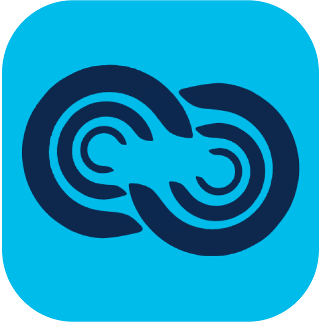
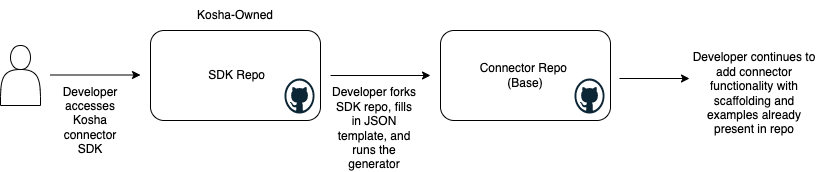

<!-- PROJECT LOGO -->
<br />
<div align="center">
  <a href="https://github.com/Cisco-Kosha/kosha-cdk">
    
  </a>

  <h3 align="center">Kosha CDK</h3>

  <p align="center">
    A Connector Development Kit for Internal & External Connectors
    <br />
    <a href="https://github.com/Cisco-Kosha/kosha-cdk/issues">Report Bug</a>
    ·
    <a href="https://github.com/Cisco-Kosha/kosha-cdk/issues">Request Feature</a>
  </p>
</div>


<!-- TABLE OF CONTENTS -->
<details>
  <summary>Table of Contents</summary>
  <ol>
    <li>
      <a href="#about-the-project">About The Project</a>
    </li>
    <li>
      <a href="#getting-started">Getting Started</a>
      <ul>
        <li><a href="#configure">Configure</a></li>
        <li><a href="#build">Build</a></li>
      </ul>
    </li>
    <li><a href="#usage">Usage</a></li>
    <li><a href="#contact">Contact</a></li>
  </ol>
</details>


<!-- ABOUT THE PROJECT -->
## About The Project

Kosha - Cisco API Hub is a SaaS solution for API developers and IT enterprises to 
* Create, deliver and observe apps and services in an API first manner
* Connect services using trusted connectors
* Stream and transform data between services
* Create Business workflows by connecting multiple services with full observability

Kosha gives users the ability to use existing connectors in the Marketplace or bring their own.

This CDK gives users a quick way to get started with Kosha connectors. By defining the connector details in the CDK configuration file and running the generation script, base scaffolding for a custom Kosha connector is created. This allows users to hit the ground running with configuration files, base models, and base functions.

### Authentication Type
Users can define the authentication method used in the client API. Kosha will auto-generate code to accept values needed by the authentication method and create any code scaffolding to fulfill the use case.

Currently, Kosha's CDK supports Basic Authentication and Custom Auth. However, solely Basic Authentication works with auto-generated endpoints. We plan to expand to other auth types as use cases are exposed. Feel free to raise a ticket if you would like a specific authentication method supported.

### Defining Endpoints
Users can also define endpoints for which they want pass through functions. The Kosha CDK will auto-generate API and client functions for these endpoints so they are accessible out of the box.

### Auto-generation of Swagger annotations
Kosha uses in-line annotations to auto-generate a Swagger doc specification for the connector and all its endpoints. Based on the connector definition, the CDK will generate the in-line annotations for each specification and config-defined endpoint as well generate the code and docs needed to expose the swagger docs in the API.

Please refer to the Usage part of this document to learn more about values needed for this definition.

<!-- GETTING STARTED -->
## Getting Started

### Configure
A new Kosha connector is defined with a config.json file with the following fields
```
{
    "connector_name": "",
    "prometheus": {
        "enabled": true
    },
    "auth": {
        "type": "",
        "domain": "",
        "me_endpoint":  {
            "path": "",
            "method": ""
        }
    },
    "endpoints" : [
        {
            "name": "",
            "description": "",
            "api_path": "",
            "method": "",
            "kosha_path": "",
            "query_parameters": [
                ""    
            ],
            "enable_all_parameters": true,
            "tag": ""
        }
    ]
}
```

#### Prometheus
Enabling the Prometheus field will allow the necessary scaffolding in the connector repo to be created for monitoring the connector API and eventually visualizing the data in Grafana. 

#### Auth
This defines the authentication method used for the client API. Currently, only Basic Authentication is supported in conjunction with auto-generated endpoint scaffolding. 

#### Endpoints
Endpoints are defined if the user wants auto-generated client API functions. At the moment, these are pass through functions that take in parameters and body fields and return the associated response. 

The Api Path connects to the client API whereas the Kosha Path is the endpoint Kosha users would utilize to access the connector function.

The EnableAllParameters field allows the user to determine if they would like all parameters to be accepted or would like to limit parameters solely to the defined query. 

The Query Parameters field can also be used to expose certain parameters to Swagger docs for ease of testing.

The Description and Tag fields are used in Swagger doc generation.

### Build
 
1. Clone the repo
   ```sh
   git clone https://github.com/Cisco-Kosha/teamwork-connector.git
   ```
2. Populate the `config.json` with connector details
3. Ensure an existing connector directory with the same name does not exist. The Kosha CDK will overwrite any existing directories
4. Run the `Makefile` and generate a new Kosha connector directory


<!-- USAGE EXAMPLES -->
## Usage



This connector development kit is to get users started on their Kosha connector journey. It aids developers in getting started with their connector code by giving them a base to build on. 

Kosha connectors can be extended to be as complex as the user wants. Users are encouraged to build upon it with custom functions and endpoints leveraging the power of their client API and transforming it into their own.


<!-- CONTACT -->
## Contact

Kosha's Developer Team - kosha-support@cisco.com

